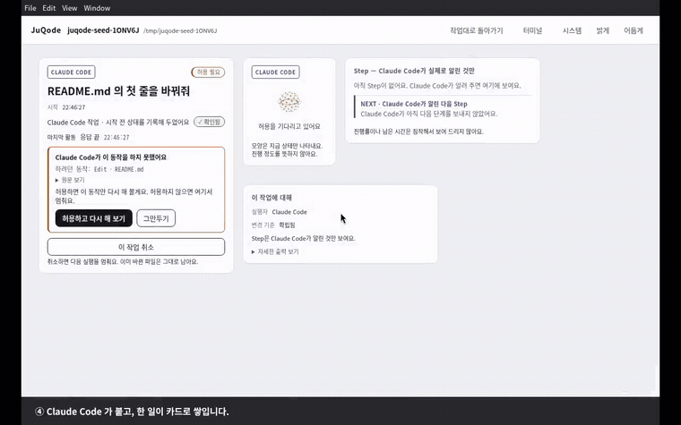

# JuQode

> ## Developers Code. Vibe Coders Qode.

<!--PRODUCT-SENTENCE-->
JuQode 는 비개발자가 소프트웨어 프로젝트를 이해하고, Claude Code 에게 변경을 요청하고,
그 작업을 이해할 수 있는 카드로 따라가고, 안전한 기술 동작 몇 가지를 자연어로 실행하고,
실제 코드 변경을 raw diff 부터 시작하지 않고 읽을 수 있게 해 주는 데스크톱 워크벤치다.
<!--/PRODUCT-SENTENCE-->

---

## 받아서 써보기 (Windows)

1. **[JuQode-0.1.0-x64.exe 내려받기](https://github.com/ju0o/JuQode/releases/download/demo-v0.1/JuQode-0.1.0-x64.exe)** (109 MB)
   서명이 없어 SmartScreen 경고가 뜬다 — **추가 정보 → 실행**.
   체크섬 확인: [`JuQode-0.1.0-x64.exe.sha256`](https://github.com/ju0o/JuQode/releases/download/demo-v0.1/JuQode-0.1.0-x64.exe.sha256)
2. 실행 전 **Claude Code CLI**를 설치하고 로그인해 둔다.
   JuQode 는 Claude Code 를 대신하지 않는다 — 이미 설치된 Claude Code 에 붙는 얇은 층이다.
3. JuQode 를 열고 프로젝트 폴더를 선택한다.

---

## 실사용 영상 (1분 22초)

[](https://youtu.be/0wTQGH99Hxs)

▶ **[YouTube 에서 전체 영상 보기 (1분 22초)](https://youtu.be/0wTQGH99Hxs)**
— 위 GIF 는 그중 8초다. mp4 원본: [내려받기 (0.9 MB)](https://github.com/ju0o/JuQode/releases/download/demo-v0.1/juqode-usage.mp4)

**이 영상에 연출은 없다.** `scripts/demo/record-demo.mjs` 가 e2e 테스트와 **같은 fixture** 로
진짜 Electron 앱을 띄우고, 진짜 CDP 로 클릭하고, Xvfb 화면을 ffmpeg 으로 그대로 받아 적었다.
영상에 나오는 카드·문구·색은 전부 제품이 그린 것이고, **화면 아래 검은 자막 띠 하나만** 녹화
스크립트가 얹은 것이다.

| 구간 | 무엇을 보여주나 |
|---|---|
| 0:07 | 프로젝트를 열면 **시키지 않아도** 먼저 읽는다 |
| 0:15 | 여섯 답 — `확인됨` 인 답은 근거 파일을 지목한다 |
| 0:20 | 자연어로 요청 → 보낸 말이 곧 작업의 이름 |
| 0:28 | **권한은 거절된 채로 도착한다.** JuQode 가 대신 허용하지 않는다 (D-133) |
| 0:33 | 허용 → **같은 세션이 그 자리에서 재개된다** |
| 0:39 | 변경 읽기 — 없는 설명은 지어내지 않고, 요청해야 읽는다 |
| 0:54 | Quick Command — 설명 → 확인, 두 번의 왕복. 모르는 말은 짐작하지 않는다 |
| 1:15 | 테마 둘 |

직접 다시 찍으려면:

```bash
npm run demo          # → docs/dev-evidence/demo/juqode-usage.mp4
```

---

## MVP 여섯 가지 능력

| | 능력 | 영상에서 |
|---|---|---|
| 1 | **Project Interpretation** — 프로젝트가 무엇인지 이해시킨다 | 여섯 답 · `확인됨` 은 근거 파일을 반드시 지목한다 |
| 2 | **Work Stream + History** — 지난 · 지금 · 다음 작업을 카드로 따라간다 | Step 카드 · `NEXT` 칸 · 끝난 작업의 결과 카드 |
| 3 | **Claude Code ONLY** — 코딩 에이전트는 Claude Code 하나뿐이다 | 권한 거절 카드 → `허용하고 다시 해 보기` → **같은 세션 재개** |
| 4 | **Deterministic rule-based NL Quick Commands** — 규칙 기반 자연어 빠른 실행 | 규칙 **8개**, 항상 *설명 → 확인* 두 번의 왕복. 모르는 말은 짐작하지 않는다 |
| 5 | **Diff Code Reader by meaningful code block** — 의미 있는 블록 단위로 읽는다 | 무엇을 · 왜 · 어떤 동작에 → 코드 → Raw Diff |
| 6 | **Minimal Terminal Drawer** — 필요할 때만 열리는 최소 터미널 | 화면을 덮되 뒤가 보이는 서랍 |

**이 제품이 하지 않기로 한 것들** — JuQode 는 사용자를 대신해 권한을 허용하지 않고,
알아듣지 못한 말을 짐작해 실행하지 않고, 근거 없는 답에 `확인됨` 을 붙이지 않고,
차단 목록(blocklist)을 만들지 않는다. 이 네 가지는 전부 **테스트가 강제한다.**

---

## 지금 상태 — 잰 값만

| | 값 | 어떻게 쟀나 |
|---|---|---|
| 단위 테스트 | **500 / 597** (`term.test.js` 포함 · 전체 스위트 정상 종료) | `npm run test:unit` |
| e2e | 실측 재확인 필요 | `npm run test:e2e` |
| ERD ↔ 스키마 대조 | **MVP 26표 일치** | `npm run test:erd` |
| 렌더러 뮤테이션 생존자 | **0** | 배치 35 스윕 (`docs/dev-evidence/mvp-run/`) |
| 구현 코드 / 테스트 코드 | 12,749줄 / **15,321줄** | `wc -l` |
| WBS 39개 | 37 구현 · 2 미착수 | `docs/dev-evidence/mvp-run/WBS-LEDGER.md` |
| 런타임 의존성 | **Electron 뿐** (`typescript` 는 선택 — 없으면 블록 분할이 S2 로 내려간다) | `package.json` |

### **`MVP_CERTIFIED = NO`**

넷이 전부 닫혀야 YES 다. 지금 닫힌 것은 **하나도 없다.**

| | 남은 것 | 막고 있는 것 |
|---|---|---|
| ① | WBS-32 비개발자 도그푸드 (G-1~G-11) | **사람 3명** |
| ② | WBS-33 패키징 · 서명 표시 확인 | Windows 호스트 |
| ③ | `MVP_WINDOWS_CERTIFIED` — **Win10 1809+ 와 Win11 둘 다** | Windows 두 환경. 한 대로는 `STARTED` 까지다 |
| ④ | 가독성(R) 트랙 + 재측정 | ① 이 먼저 — 우선순위를 코드 계수가 아니라 사람이 막힌 지점이 정한다 |

계획 전문: **[`docs/design/WBS_REMAINING.md`](docs/design/WBS_REMAINING.md)** (56작업 · 약 72시간 · 게이트 7개)

---

## 직접 돌려보기

```bash
git clone https://github.com/ju0o/JuQode.git
cd JuQode
npm ci
npm start          # Electron 앱
npm test           # 단위 597 + e2e 3종 (Linux 는 xvfb-run 이 필요하다)
npm run demo       # 실사용 영상 다시 찍기 (Xvfb + ffmpeg 필요)
```

> **Windows 10 1809+ / Windows 11 은 대상 OS 이지만 아직 검증되지 않았다.** `npm start` 는
> 돌 것으로 보이지만, 그렇게 적힌 곳은 `DEFERRED_VALIDATION.md` 의 13행이고 전부 미측정이다.
> ConPTY · `PATHEXT` · 프로세스 트리 종료 · NTFS 대소문자는 **Windows 에서만 진짜다.**

> **`main` 이 곧 현재 상태다.** 구현은 `dev/mvp-autonomous-v01` 에서 자란 뒤
> [PR #4](https://github.com/ju0o/JuQode/pull/4) 로 병합되었다. 병합은 **인수 판정이 아니다** —
> 위의 `MVP_CERTIFIED = NO` 가 그대로 유효하다.

### 저장소 지도

```
app/main/          Electron 메인 — db · claude · work · change · qc · term · interpret
app/renderer/      화면 다섯 (SC-01 · SC-02 · SC-03 · SC-04 · TD-01) + 디자인 토큰
docs/design/       ERD · DBML · 백엔드 A안 · 남은 작업 WBS · ScreenSpec 캔버스 생성기(25장)
docs/dev-evidence/ 배치별 QA 보고 · 스크린샷 · 뮤테이션 스윕 · WBS 원장
scripts/demo/      실사용 영상 녹화기
tests/             단위 597 + e2e 3종 (visual.mjs 는 단언 618개)
```

---

## Product SSOT

> ### Product SSOT 는 `JuQode-Private/docs/current/00_MASTER_INDEX.md` 다.
>
> 제품 정의 · 범위 · 결정 이력을 알아야 한다면 거기서 시작한다.
> **이 저장소는 제품 정의를 들고 있지 않다.**

이 저장소는 그 결정들을 **테스트로** 들고 있다. 그래서 Canon 을 위반하는 변경은 기능이 아니라
빨간 테스트로 나타난다 — `tests/qc.test.js` 의 57케이스 말뭉치, `tests/term.test.js` 의
「프로그램 이름 목록 금지」, `tests/unit.test.js` 의 능력 격리 검사가 그 자리다.

---

## 이전 세대에 대하여

**2026-09-06 이전의 JuQode Product / Architecture / Design 문서는 현재 진실이 아니다.**

이전 세대는 **Git history 와 archive ref 로만** 보존된다.
활성 트리에는 `docs/archive/` · `historical/` · `legacy/` · `old/` 를 두지 않는다.

| archive ref | 내용 |
|---|---|
| `archive/pre-product-reset-2026-09-06` | 이전 세대 설계 · 아키텍처 · 실험 · 프로토타입 (133 files) |

> **archive ref 안의 프로토타입은 폐기된 제품의 동작하는 코드다.**
> 구현 기준선으로 쓰지 않는다. 제품을 추론하기 위해 읽지 않는다.
